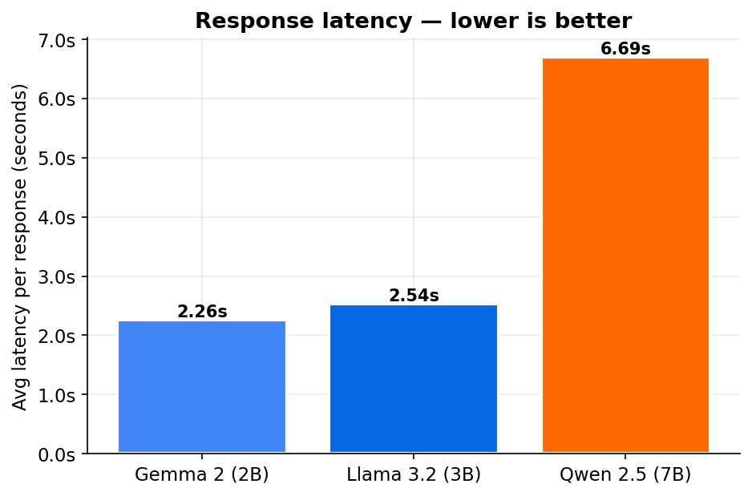
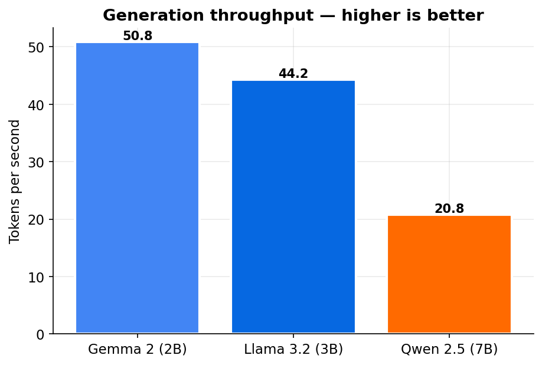
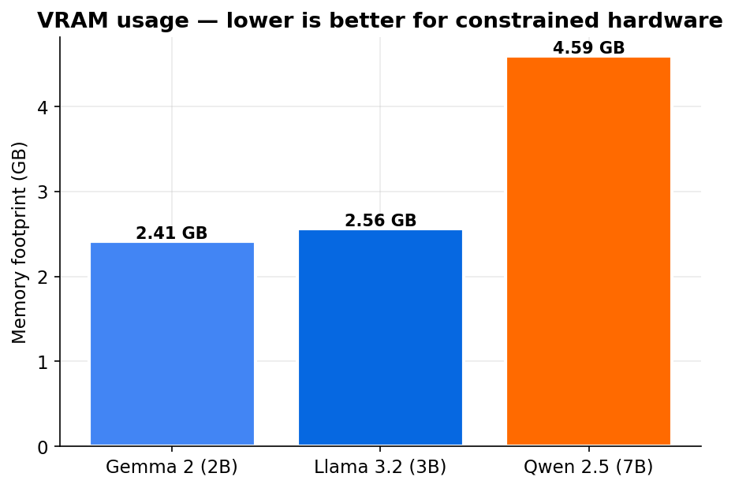
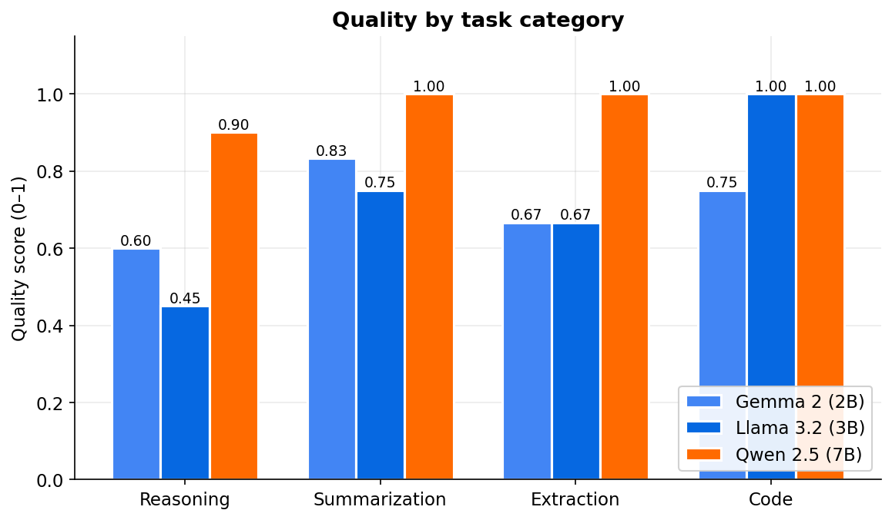

# Benchmarking Local Small Language Models

A practical comparison of three small language models running locally via Ollama on consumer hardware. This project measures not just how fast they are, but how good they are, how much memory they need, and when you'd reach for each one.

## TL;DR

I benchmarked Gemma 2 (2B), Llama 3.2 (3B), and Qwen 2.5 (7B) on an 8 GB M2 MacBook Air across 14 prompts in 4 task categories: reasoning, summarization, structured extraction, and code generation.

Llama 3.2 3B underperformed the smaller Gemma 2B on reasoning, while tying Qwen 7B on code generation. Qwen 7B dominated most categories but paid a real cost: roughly 3x the latency, 2x the memory, and less than half the throughput of the smaller models.

| Model | Verdict |
|---|---|
| **Gemma 2 (2B)** | The lightweight default. Fast, memory-light, surprisingly sharp on reasoning for its size. Ships sneaky bugs on harder code. |
| **Llama 3.2 (3B)** | A specialist. Excellent at code, mediocre at reasoning. Not an obvious step up from Gemma. |
| **Qwen 2.5 (7B)** | The quality leader. Best scores across three of four categories. Costs ~5 GB memory and ~7 s per response. |

## Why run models locally?

There are four reasons a team or a customer would pick a locally-hosted small model over calling a frontier API:

1. **Privacy.** Prompts and responses never leave the machine. For healthcare, legal, or internal-document workflows, this is often non-negotiable.
2. **Latency.** No network round-trip, no provider queuing. Time-to-first-token on a warm model here was consistently under a second.
3. **Cost.** Zero per-request cost after you own the hardware. High-volume workflows that would cost thousands monthly on an API can run free locally.
4. **Offline capability.** The model works on a plane, or on a laptop with intermittent connectivity.

The tradeoff, of course, is that local small models are measurably worse than frontier APIs at most tasks. This benchmark is about understanding how much worse, and which specific tasks remain viable.

## The lineup

Three models, three different labs, three distinct size tiers:

| Model | Lab | Parameters | Footprint | Role |
|---|---|---|---|---|
| Gemma 2 2B | Google | 2.6B | 2.4 GB | Ultra-small tier |
| Llama 3.2 3B | Meta | 3.2B | 2.6 GB | Mid-size default |
| Qwen 2.5 7B | Alibaba | 7.6B | 4.6 GB | Larger tier |

All three were pulled via Ollama at Q4_0 quantization, the default quantization for these models, which trades a small quality hit for a ~4x memory reduction versus full-precision weights. This is the format most people running local models actually use.

The lineup was chosen deliberately. Two similarly-sized models (Gemma 2B and Llama 3B) isolate the "lab and training recipe" variable at a fixed scale. Qwen 7B adds a clean scale comparison.

## Methodology

### Hardware

All benchmarks ran on a single M2 MacBook Air with 8 GB unified memory. Inference used Metal (Apple's GPU acceleration). No external GPU, no cloud offload.

### Operational discipline

An 8 GB machine is tight for a 7B model. To get honest numbers rather than swap-contaminated ones:

- Models were loaded **strictly sequentially**, one model's full sweep completed before the next started loading.
- Between model sweeps, the previous model was **explicitly unloaded** via Ollama's `keep_alive: 0` parameter to free VRAM.
- Non-essential applications (browsers, Slack, etc.) were closed for the duration of the run.
- A warmup call was made against each model before any measurement, so cold-start latency didn't contaminate the first prompt's timing.

### Prompt suite

14 prompts across 4 categories:

- **Reasoning (5):** Arithmetic word problems, logic puzzles, common-sense traps. Included a trick question ("a farmer has 17 sheep, all but 9 die") and the classic 3-switches puzzle.
- **Summarization (3):** Varying source-text complexity, from a Python history paragraph to a technical explanation of sub-quadratic transformer alternatives.
- **Structured extraction (3):** Pydantic-schema extraction via the Instructor library. Included a "don't hallucinate" test where the source text explicitly withheld a field.
- **Code generation (3):** `is_palindrome`, `two_sum`, and `longest_substring_without_repeating`, executed against test cases.

Difficulty within each category varied from easy to hard. The same prompts were used for all three models to keep the comparison fair.

### What was measured

For every (model × prompt) pair:

- **Time-to-first-token (TTFT):** How long the user waits before seeing any output. Captured by streaming the response and timestamping the first non-empty chunk.
- **Total latency:** End-to-end wall-clock time.
- **Tokens per second:** Raw generation throughput, using Ollama's own `eval_count` and `eval_duration` fields (which isolate the generation phase from prompt processing).
- **Memory footprint:** Captured from Ollama's `/api/ps` endpoint rather than process RSS. This is a deliberate methodological choice — on Apple Silicon, Metal manages model weights in GPU-shared memory that doesn't appear in any process's RSS accounting. `/api/ps` reports the actual VRAM footprint, which is the number that matters for hardware planning.

All measurements persisted to SQLite so charts and analysis could be regenerated without rerunning the benchmark.

### How quality was scored

Different tasks need different scoring methods. "Accuracy" means something different for each category:

- **Reasoning and summarization:** LLM-as-judge using Claude Sonnet 4.5, with a 1–5 rubric normalized to 0.0–1.0. The judge was prompted with the prompt, the expected answer, and the model's response. The rubric was category-specific: reasoning emphasized correctness and logical soundness; summarization emphasized faithfulness, completeness, and conciseness.
- **Structured extraction:** Pydantic schema validation via Instructor (with retries), plus field-by-field correctness checking. Score is a blend: 0.5 for a successfully validated schema, and up to 0.5 more for correct field values.
- **Code generation:** Generated functions were executed in a restricted namespace against test cases. Score is the fraction of test cases that passed.

## Results

### Latency



Gemma and Llama sit at the same general performance tier, around 2.3–2.5 seconds per response on average. Qwen nearly triples that to 6.7 seconds. This is the first place where the "size tax" shows up clearly: a 7B model on this hardware is measurably slower to interact with.

### Throughput



Tokens per second tells a similar story from the other direction. Gemma generates at roughly 51 tok/s, Llama at 44, Qwen at 21. The 2.5x throughput drop from Gemma to Qwen is roughly proportional to the parameter count increase.

### Memory



The memory picture is non-linear. Going from Gemma (2B) to Llama (3B) adds only ~150 MB — both quantize to similar sizes at Q4. Going from Llama (3B) to Qwen (7B) adds ~2 GB.

### Quality by category



This is where the story gets interesting. Qwen wins three of four categories outright. But the relationship between the two smaller models flips depending on the task:

- **Reasoning:** Gemma (0.60) beats Llama (0.45).
- **Summarization:** Gemma (0.83) beats Llama (0.75). Gemma again.
- **Extraction:** Tied at 0.67. No daylight between them.
- **Code:** Llama (1.00) jumps to tie Qwen. Gemma (0.75) falls behind.

If you went by parameter count alone, you'd predict Llama to beat Gemma in every category. That's not what the data says. Llama is specialized, as it is great at code but it is weak at reasoning, while Gemma is the more balanced small model.

## The interesting findings

The numbers are only part of the story. Looking at actual model responses surfaces specific failure modes that the aggregate scores hide.

### Llama 3.2 fails reasoning in three different ways

Llama missed three of five reasoning prompts, but each miss looked completely different:

**Prompt:** "If a train leaves Chicago at 3pm traveling 60 mph, and another leaves New York at 4pm traveling 80 mph toward Chicago, and the cities are 790 miles apart, at what time will they meet?"

Llama correctly computed that the trains meet 5.21 hours after 4 PM — the math was right. It then wrote the final answer as **"9:21 AM"** instead of PM. A last-mile formatting error after correct reasoning. In a production workflow, a user might skim the response, see the AM/PM error, and lose all trust in the model's output.

**Prompt:** "A farmer has 17 sheep. All but 9 die. How many are left?"

Llama answered **"8."** No reasoning shown. It fell for the misdirection and subtracted 9 from 17 without catching that "all but 9" means 9 survive. Gemma got this right.

**Prompt:** The 3-switches puzzle.

Llama proposed flipping two switches, entering the room, then flipping the third switch — **violating the "you can only enter once" constraint.** A comprehension failure, not a reasoning failure.


### Only Qwen 7B grasped the heat-based solution to the 3-switches puzzle

This prompt was the cleanest discriminator in the whole suite:

- **Gemma:** Suggested flipping two switches and turning on a third after entering the room. Classic beginner answer. Missed the heat trick. Score: 0.00.
- **Llama:** Violated the single-entry constraint. Score: 0.00.
- **Qwen:** Turned on switch A, let it heat up, turned it off, turned on switch B, entered the room. Correctly identified "lit bulb = B, warm bulb = A, cold bulb = C." Score: 0.75. (The 0.25 deduction was for slightly confusing phrasing around which bulb had been heated.)

Only the 7B model grasped that you can use the *physical state* of a bulb to distinguish a third condition.

### Qwen's extraction perfection partly belongs to Instructor

Qwen scored 1.00 on all three structured-extraction prompts.

Looking at the raw responses, Qwen's first pass returned Markdown-formatted bullet lists with 5–6 fields, more information than the schema asked for. The Instructor library's schema-enforcement layer then coerced those responses into the target Pydantic model, dropping extra fields and normalizing types.

So the 1.00 reflects **the entire pipeline (model + Instructor)**, not just the model's raw output. A smaller model with weaker schema compliance benefits more from Instructor's enforcement than a larger model that would already return cleaner JSON. 

## When to use which model

Based on these results, a rough decision framework:

**Pick Gemma 2B if:**
- Latency matters more than edge-case quality
- Hardware is constrained
- Tasks are summarization, simple reasoning, or simple extraction
- You need high throughput

**Pick Llama 3.2 3B if:**
- Code generation is the primary workload
- You want a similar memory footprint to Gemma with meaningfully better code quality
- Avoid for reasoning-heavy tasks as it underperforms the smaller Gemma

**Pick Qwen 2.5 7B if:**
- Quality is the priority and latency is tolerable
- Hardware has at least 5 GB of headroom after the OS
- The workload includes reasoning, complex extraction, or tasks where edge cases matter

### Routing in practice

The decision framework above is operationalized in the `/route` endpoint. A two-layer classifier (regex pre-pass, then Gemma 2B with Instructor as fallback) buckets each prompt into one of the four categories or `general`, and the router dispatches to the model the latest benchmark batch identifies as best for that bucket. Mapping is read from SQLite per-request, so a fresh benchmark run reshapes routing without a code change.

Measured on a curated 20-prompt eval set (5 reasoning, 4 each of summarization/extraction/code, 3 general):

- **Classification accuracy: 85% (17/20).** All three misses came from the LLM-fallback path; the heuristic was 11/11 when it fired. Ticket target: 85%.
- **Classifier latency: mean 483ms, p95 1181ms.** Heuristic hits return in <1ms; the LLM fallback adds 700–1800ms per call due to Gemma 2B TTFT under local Ollama. Ticket target was p95 < 500ms; the LLM path alone exceeds that, so any prompt that touches the fallback blows the budget.

The honest read: the two-layer design works exactly as intended, but the 500ms p95 target was set assuming Gemma 2B inference is sub-500ms. On this hardware (M2 Air, Ollama Q4_0) it isn't. Two follow-ups would close the gap: (1) replace the LLM fallback with a sentence-embedding plus nearest-neighbour classifier (sub-50ms even at p99), or (2) cache classification results by prompt hash so the LLM path runs at most once per unique prompt. Both are out of scope for this PR.

The fallback chain was verified end-to-end with a forced validation failure. A code prompt routed to Llama 3.2 3B, failed validation by injection, and walked to Qwen 2.5 7B as expected, the next entry in the code category's chain.

## Limitations and what's next

This benchmark is a useful starting point, not a final verdict. Specific weaknesses:

- **Sample size.** 14 prompts is directionally useful but far from statistically rigorous. A 50–100 prompt suite would produce tighter confidence intervals and surface rarer failure modes.
- **One judge.** All LLM-judge scoring was done by Claude Sonnet 4.5. A multi-judge setup (majority voting across different models) would reduce the risk of systematic bias in either direction.
- **One hardware target.** Latency and throughput numbers here reflect M2 Apple Silicon with Metal. An NVIDIA GPU with CUDA would invert the story on 7B models, the memory constraint lifts and throughput becomes far less punishing. Different hardware would reshape the "when to use which" recommendations substantially.
- **No quantization comparison.** All three models were Q4_0. Comparing Q4 vs Q5 vs FP16 would show whether the quality gaps close or widen with more bits per weight.
- **No prompt engineering.** Models were called with default temperatures and no system prompts. A well-tuned system prompt would change the absolute scores, though probably not the relative ordering.

Future extensions I'd add: a larger prompt suite, multi-judge scoring, a run on NVIDIA hardware for comparison, and an explicit quantization-level comparison for each model.

## Reproducing this benchmark

The code is in this repository. To reproduce on compatible hardware:

```bash
# Prerequisites: Ollama installed, Python 3.12+
ollama pull gemma2:2b
ollama pull llama3.2:3b
ollama pull qwen2.5:7b

python -m venv venv
source venv/bin/activate
pip install -r requirements.txt

# Your Anthropic API key for the LLM judge
echo "ANTHROPIC_API_KEY=sk-ant-..." > .env

# Run the full sweep
python scripts/run_benchmark.py

# Generate the charts
python scripts/generate_charts.py

# Browse individual runs
python scripts/inspect_runs.py --failures
```
